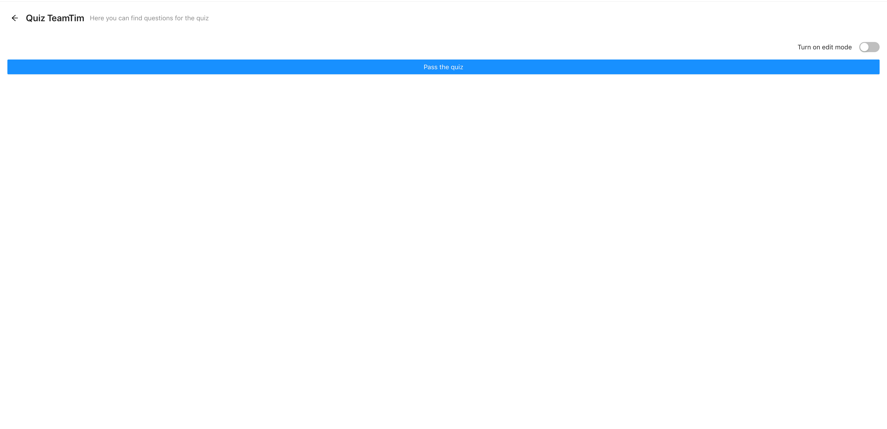
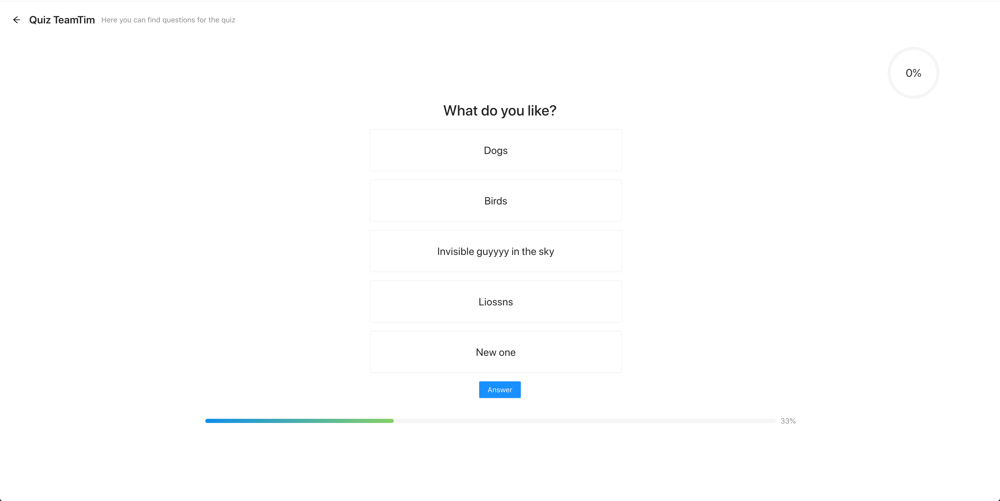
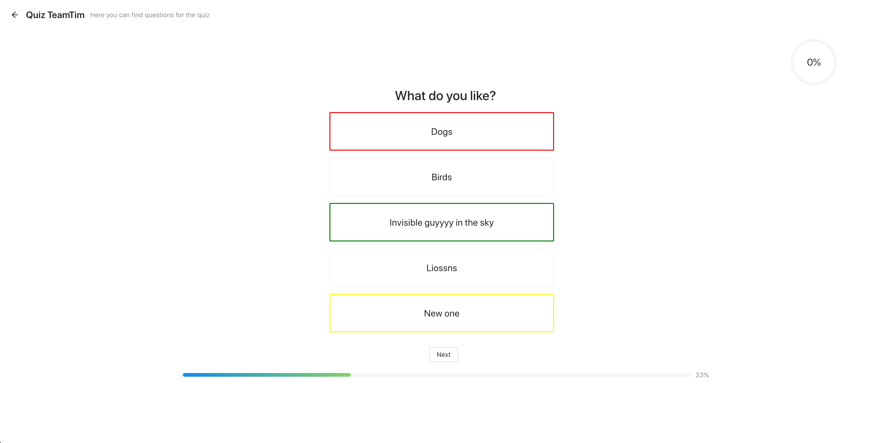
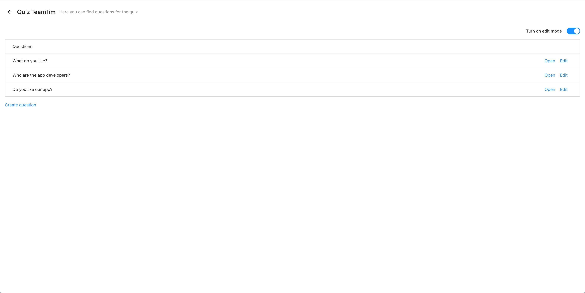

## Requirements

node - 14.15.1,
npm - 6.1.0,
jsdoc - 3.5.5,

## How to launch locally

1. Install dependencies `npm install`
2. Launch app `npm start`

## Documentation

Open locally `docs/index.html`

## Tests

For coverage view 
- locally run `npm run test`
- result in `coverage/lcov-report/index.html`

## How to use

### Quiz mode

Push the button for quiz start

At the beginning you see questioon with answers

You should select answers

And click on Answer button, then you see correctness of your answers
- Red color means that this answer is yours and your answer is incorrect
- Yellow color means that you didn't mention this answers and this answer is correct answer

- Green color means that this answer is yours and your answer is correct

### Edit mode

Questions list with edit mode
You can open some question for edition or for view
Also you can create new one

You can open question for view for checking 
how it will be seen in quiz

You can create question

You can change question text, 
answers text and add/delete answers

